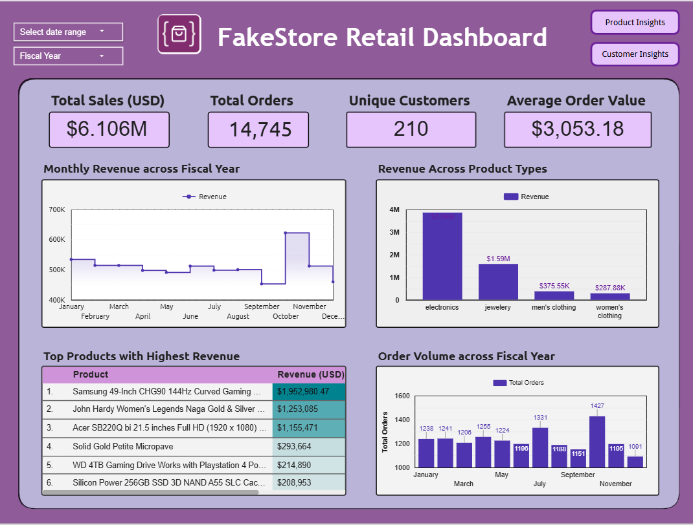
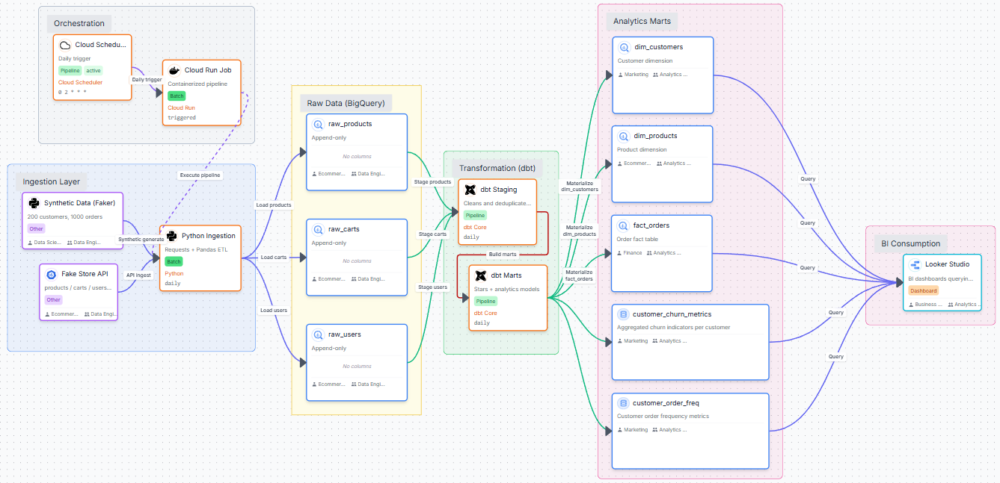
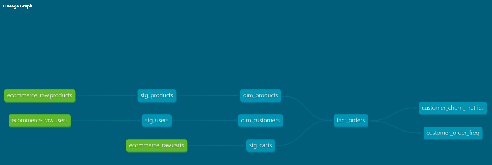

# E-Commerce Analytics Pipeline

An automated end-to-end data pipeline that ingests e-commerce data from a REST API, transforms it through a layered dbt architecture on Google BigQuery, and serves a live business intelligence dashboard — deployed on GCP with zero manual intervention.

## Live Dashboard
[→ Google Data Studio Dashboard](https://datastudio.google.com/reporting/5c9211f1-8115-430b-879d-d146ab93248f)  

  

## Project Overview
This project was built to demonstrate production-grade data engineering practices — real API ingestion, cloud deployment, automated orchestration, and business-focused visualisation — using an e-commerce domain as the analytical context.

Data is sourced from the [Fake Store API](https://fakestoreapi.com) and supplemented with synthetic records generated via the [Faker](https://github.com/joke2k/faker) library, producing a dataset of 200 customers and 1,000 orders with realistic distributions across cities, dates, and product categories.

Raw data lands in BigQuery in an **append-only pattern** — every pipeline run appends timestamped rows without overwriting, preserving full ingestion history. Transformations are handled by **dbt Core**, which builds a star schema through two layers: a staging layer for cleaning and standardisation, and a marts layer for business metrics and KPIs. The entire pipeline runs automatically on a weekly schedule via **GCP Cloud Scheduler and Cloud Run**, with dbt data quality tests executing after every transformation run.

## Architecture

## Tech Stack
| Layer | Technology |
|---|---|
| Data source | Fake Store API (realistic e-commerce data), Python Faker library (synthetic data) |
| Ingestion | Python (requests, pandas) |
| Storage | Google BigQuery |
| Transformation | dbt Core (BigQuery adapter) |
| Orchestration | GCP Cloud Scheduler + Cloud Run |
| Containerisation | Docker |
| Visualisation | Google Data Studio |

## Data Model

The data model follows a **star schema** pattern:

- `fact_orders` — one row per order line item, containing revenue, quantity, and date metrics
- `dim_products` — product attributes including category, price tier, and rating category
- `dim_customers` — customer attributes including city and order frequency band

Two additional analytical models are built on top of the marts:
- `customer_churn_metrics`
- `customer_order_freq`

## Dashboard Features
- Executive summary with revenue KPIs
- Product performance by category, price tier, rating
- Customer retention and order frequency analysis
- Geographic breakdown by city
- New vs returning customer trend

## Pipeline Flow
**Cloud Scheduler (weekly)**  
↓  
**Cloud Run Job (Docker container)**  
├── ingest.py       → Fetches API data → BigQuery raw layer  
├── dbt run         → Staging views → Mart tables  
└── dbt test        → Data quality validation  
↓  
**Looker Studio dashboard (auto-refreshed)**  

## Key Insights
- There is a clear seasonality pattern observed yearly with revenue typically peaking around October to November. This could indicate an increasing spending habit among consumers around the pre-winter period.
- Electronics provide the highest revenue ($3.857M) to the business, with double the revenue compared to the second most purchased category, Jewellery ($1.59M).
- Women's Clothing has the second highest order quantity (11.08K) but lowest revenue ($287K), suggesting a significant pricing opportunity relative to other categories
- Fake Store performs extremely well in Seattle, with the highest revenue ($687K) and average purchase value ($1308/order).
- The business should focus on expanding its footprint in San Francisco as it has a high average purchase value ($1205/order) despite lower order frequency (207 orders), indicating potential spending power.

## What I'd improve with more time
- Replace Fake Store API with a live Amazon Store data stream or Shopify sandbox for truly dynamic source data
- Increase the dimensions of measures to identify potential churn factors
- Integrate Conversational Agents into the project to increase its viability for business prospects.
- Add a CI/CD pipeline via GitHub Actions to run dbt tests and executions on every pull request.

## Connect with me here!
[LinkedIn](https://www.linkedin.com/in/suvan-ravi-b695631b8/)